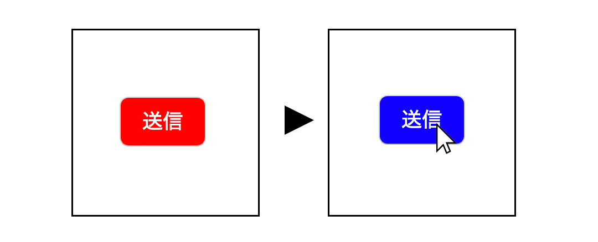

# アニメーション

CSSを使ったアニメーションの使い方を説明します。
実際にコードを書きながら学んでいきましょう。

以下の流れで説明していきます。

1. 準備
2. アニメーションを作成する
3. アニメーションを追加する
4. 各プロパティの説明
5. 省略した書き方
6. transition

### 目標
h1タグの中の文字「Hello」の大きさを`50px`から`100px`に変えるアニメーションを作成する。

## 1. 準備
- `animation`という名前のフォルダを作成し、その中に`index.html`と`style.css`を追加しましょう。

-  `index.html`の中に以下のコードをコピーしてください。
    ```html
    <!DOCTYPE html>
    <html lang="en">
    <head>
        <meta charset="UTF-8">
        <meta name="viewport" content="width=device-width, initial-scale=1.0">
        <link rel="stylesheet" href="style.css">
        <title>Document</title>
    </head>
    <body>
        <div class="container">
            <h1>Hello</h1>
        </div>
    </body>
    </html>
    ```

-  `style.css`の中に以下のコードをコピーしてください。
   ```css
    * {
    margin: 0;
    padding: 0;
    }
    .container {
        border: 1px solid black;
        width: 100vw;
        height: 700px;
        display: flex;
        justify-content: center;
        align-items: center;
        flex-direction: column;
    }
    h1 {
        font-size: 50px;
    }
   ```
`.container`の中には、見やすいように要素を中央に配置するためのコードが書いてあります。


## 2. アニメーションを作成する
- アニメーションを作成する場合は、以下のような`@keyframes`というものを使います。以下のコードを`style.css`内の `h1 { font-size: 50px }`の下に追加しましょう。
```css
@keyframes bigger-font {
    from {
        font-size: 50px;
    }
    to {
        font-size: 100px;
    }
}
```
### 上記のコードの説明
- `@keyframes`の隣にある`bigger-font`は、アニメーションの名前です。好きな名前を付けることができますが、一目見てどんなアニメーションなのかわかりやすい名前を付けましょう。
- さて、`@keyframes`の中に`from {...}`と`to {...}`があります。`from`の中には、アニメーションが始まる時の、初期の値を書き、`to`の中には、アニメーション終了時の値が入っています。
- 以上のことを要約すると、アニメーション`bigger-font`は、`font-size`を`50px`から`100px`へと変えるアニメーションです。
- `from`と`to`意外に、`%`を使う方法もあります。この場合は、間の地点での値も書くことができます。
```css
@keyframes bigger-font {
    0% {
        font-size: 50px;
    }
    50% {
        font-size: 150px;
    }
    100% {
        font-size: 100px;
    }
}
```
この場合、文字の大きさは、「50px→150px→100px」と変化します。

## 3. アニメーションを追加する
- 次に行うのは、今作成したアニメーションをどの要素に付けたいのかを書き加えることです。
- ここでは`h1`タグの中のコンテント（Hello）の大きさを変えたいので、`h1`の中にアニメーションの情報を書いていきます。
```css
h1 {
    font-size: 50px;
    animation-name: bigger-font;
}
```
- アニメーションを追加したい場合、`animation-name`というプロパティを使います。値は、先ほど作成した、アニメーションの名前である`bigger-font`です。
- これだけでは、アニメーションは作動しません。アニメーションを動かすには、詳しい設定を書いていかなければなりません。

## 4. 各プロパティの説明
- ここで説明するのは以下の7つのプロパティです。
  <!--
  - animation-duration
  - animation-timing-function
  - animation-delay
  - animation-iteration-count
  - animation-direction
  - animation-fill-mode: forwards; -->

|プロパティ|説明|値の例|
|:---:|:---|:---|
|animation-name|どのアニメーションを追加するのか指定する|任意のアニメーション名|
|animation-duration|アニメーションが何秒かけて実行されるのかを指定| 3s（3秒）|
|animation-timing-function|アニメーションの動き方の指定。一定のスピードで動かしたり（linear）、始めと終わりだけゆっくりにする（ease-in-out）などの設定ができる。| linear, ease-in, ease-out, ease-in-out |
|animation-delay| 指定した秒数アニメーションが遅れて実行される。| 2s |
|animation-iteration-count|繰り返す回数を指定する。| 2（回数）, infinite（無限）|
|animation-direction|アニメーションの完了時に、逆方向にアニメーションして繰り返すか、始めの状態にリセットしてアニメーションを繰り返すかを設定する。| normal, reverse, alternate, alternate-reverse|
|animation-fill-mode|アニメーション終了時の値をどこに合わせるか指定。|none, forwards, backwards, both|

### 補足説明
- 値の例で`3s`とありますが、`s`は`second(秒)`という意味。単位は`s`の他に`ms(millisecond)`もあり、これは1000分の1秒（0.001秒）という意味。（1s = 1000ms）
- `animation-direction`：`alternate`を指定すると、開始時の値と終了時の値を往復する。
- `animation-fill-mode`：`forward`なら、終了時の値がそのままキープされ、初期値に戻らない。

実際に上記のプロパティを`h1`の中に追加してみましょう。
```css
h1 {
    font-size: 50px;
    animation-name: bigger-font;
    animation-duration: 3s;
    animation-timing-function: linear;
    animation-delay: .5s;
    animation-iteration-count: 2;
    animation-direction: normal;
    animation-fill-mode: forwards;
}
```
このように書くと、以下のようになります。
- bigger-fontというアニメーション
- 3秒かけて実行する。
- 一定の速さで。
- ページを読み込んでから0.5秒後に開始。
- 2回繰り返す。
- 最後は終了時の値をキープ。(100pxのままで、50pxには戻らない。)

画像のように文字が大きくなったり小さくなったりを2回繰り返して、最後は大きい文字のまま止まればOKです。


## 5. 省略した書き方

上記では、各プロパティの意味を学習するために、一つひとつ書きましたが、`animation-name`以降の7行を一列で書くことができます。

```css
h1 {
    font-size: 50px;
    animation-name: bigger-font;
    animation-duration: 3s;
    animation-timing-function: linear;
    animation-delay: .5s;
    animation-iteration-count: 2;
    animation-direction: normal;
    animation-fill-mode: forwards;
}
```

```css
h1 {
    font-size: 50px;
    animation: bigger-font 3s linear .5s 2 normal forwards;
}
```


## 6. transition

CSSでアニメーションを付けるもう一つの方法があります。

`index.html`のh1タグの下に`<button>送信</button>`を追加してください。
```html
<!DOCTYPE html>
<html lang="en">
<head>
    <meta charset="UTF-8">
    <meta name="viewport" content="width=device-width, initial-scale=1.0">
    <link rel="stylesheet" href="style.css">
    <title>Document</title>
</head>
<body>
    <div class="container">
       <h1>Hello</h1>
       <button>送信</button>
    </div>
</body>
</html>
```


`style.css`のh1タグの下に以下のコードを追加してください。
```css
button {
    margin-top: 100px;
    padding: 8px 20px;
    background-color: rgb(7, 69, 105);
    border-radius: 8px;
    font-size: 20px;
    color: white;
}
button:hover {
    background-color: rgba(7, 69, 105, .8);
}
```
追加した後の`style.css`全コード
```css
* {
    margin: 0;
    padding: 0;
}
.container {
    border: 1px solid black;
    width: 100vw;
    height: 700px;
    display: flex;
    justify-content: center;
    align-items: center;
    flex-direction: column;
}
h1 {
    /* font-size: 50px;
    animation-name: bigger-font;
    animation-duration: 3s;
    animation-timing-function: linear;
    animation-delay: .5s;
    animation-iteration-count: 2;
    animation-direction: normal;
    animation-fill-mode: forwards; */
    /* 上の7行が1行で書ける　↓ */
    animation: bigger-font 3s linear .5s 2 normal forwards;
}
@keyframes bigger-font {
    from {
        font-size: 50px;
    }
    to {
        font-size: 100px;
    }
}
button {
    margin-top: 100px;
    padding: 8px 20px;
    background-color: red;
    border-radius: 8px;
    font-size: 20px;
    color: white;
}
button:hover {
    background-color: blue;
}
```

`style.css`の今追加したコードを見てください。
セレクタが`button:hover`です。これは、「カーソルがその要素の上に来たら」という意味です。
つまり、カーソルがボタンの上に来た時、色が赤から青に変わります。
その「変わり方」を指定するのが`transition`です。
`button`の`color: white;`の下に以下のコードを追加してください。

```css
button {
    transition-property: background-color;
    transition-duration: 2s;
    transition-timing-function: linear;
    transition-delay: 1s;
}
```
先ほどのアニメーションの中で見た`duration`や`timing-function`がありますね。異なるのは、animationでは`animation-name`だった部分が、こちらでは、`transition-property`です。

そして、アニメーションと同様、省略して1行で書くこともできます。

```css
button {
  transition: background-color 2s linear 1s;
}
```
画像のようにカーソルがボタンの上部にある時、色が赤から青に変わります。


アニメーションの説明は以上になります。
<br>
<br>
<br>

## 参考リンク
この中では紹介していないこともあるので、さらに詳しく知りたい方は、以下のリンクを参考にしてみてください。

- [MDN CSS アニメーションの使用](https://developer.mozilla.org/ja/docs/Web/CSS/CSS_Animations/Using_CSS_animations)
- [MDN CSS animation](https://developer.mozilla.org/ja/docs/Web/CSS/animation)
- [MDN CSS transition](https://developer.mozilla.org/ja/docs/Web/CSS/transition)